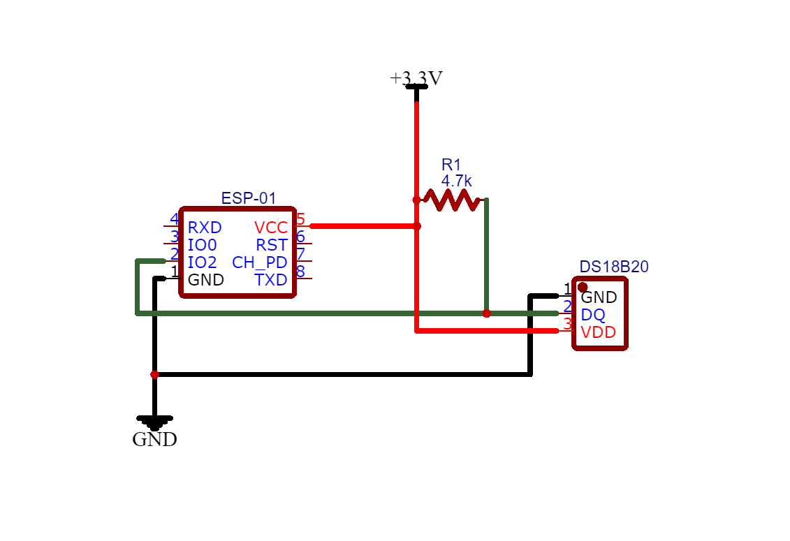

# ESP8266 RTOS Thermometer with DS18B20

In this project an ESP8266-01 is used to read the room temperature from a DS18B20, the value is then sent to a UDP server through a WiFi Lan connection.

## List of components

- ESP8266-01
- DS18B20 
- 4.7K ohm pull-up resistor

## More details
The small library I wrote for the DS1820 is not complete and doesn't cover all the sensor functions, only those necessary for this project. The ESP-01 app was developed using the ESP8266 RTOS SDK. The server is written in Python, it can handle multiple clients at the same time and displays the received data in a dynamically size window.

## Usage and requirements
This project requires the [ESP RTOS v3.3]. Follow their [instructions] to set up the toolchain and the SDK.  
`make app` compile the code.  
`make app flash` flash it into the ESP-01.  
Run the UPD server via console command or double-clicking on it.

## Schematics

[ESP RTOS v3.3]: <https://github.com/espressif/ESP8266_RTOS_SDK/tree/release/v3.3>
[instructions]: <https://github.com/espressif/ESP8266_RTOS_SDK/tree/release/v3.3#get-toolchain>
